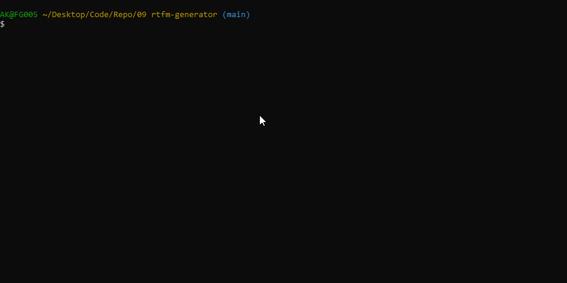

# RTFM Generator  [](https://opensource.org/licenses/MIT) 
  This readme has been procedurally generated
  
  -----------------------
  ## Table of Contents
  1. [Description](#description)
  2. [Deployed link](#deployed-link)
  3. [Installation](#installation)
  4. [Usage](#usage)
  5. [Licenses](#licenses)
  6. [Contributing](#contributing)
  7. [Tests](#tests)
  8. [Questions](#questions)

  -----------------------
  ## Description
  Having trouble writing your readme file? No worries, I've got you covered. Just use the super handy-dandy RTFM Generator. You will be prompted with a series of questions about your fantastic project and the application will handle the rest. Don't ask questions about how. It's magic!
  
  -----------------------
  ## Deployed link
  https://github.com/akhalid88/rtfm-generator

  -----------------------
  ## Installation
  To install dependencies run the following command:
  ```
  npm install
  ```

  -----------------------
  ## Usage
  To use this repo you will need a working knowledge of Javascript and Node.js. 

  
  
  To run this tool use the following command. This will generate a markdown file in the root folder with the name of 'READMETOO.md

  ```
  node index.js
  ```
  
  -----------------------
  ## Licenses
  This project uses a [MIT License](https://opensource.org/licenses/MIT). 

  -----------------------
  ## Contributing
  If you would like to contribute, you will need to know Javascript and Node.js.

  -----------------------
  ## Tests
  To run tests run the following command:
  ```
  N/A
  ```

  -----------------------
  ## Questions
  Created by akhalid88
  If you have any questions you can reach me at the following email: [akhalid.code@gmail.com](mailto:akhalid.code@gmail.com)

  Follow my other work at GitHub: https://github.com/akhalid88/
  